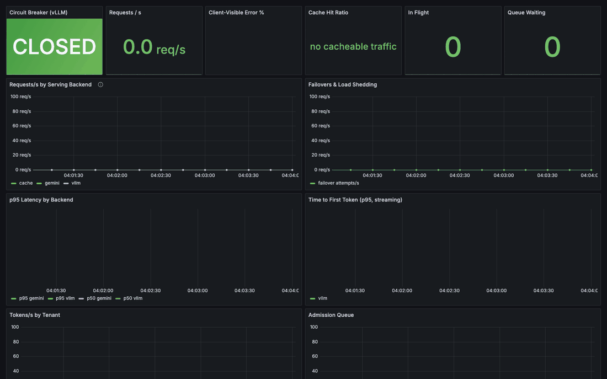
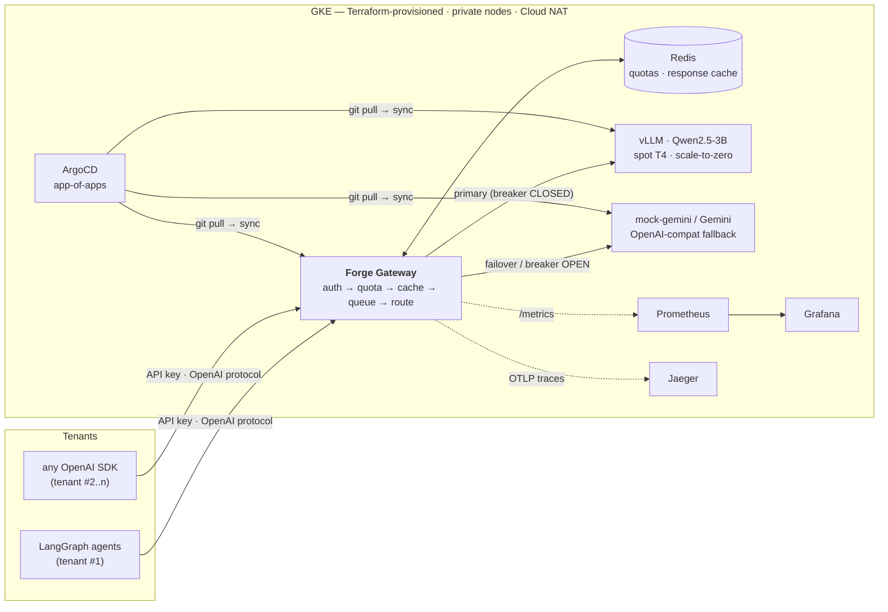
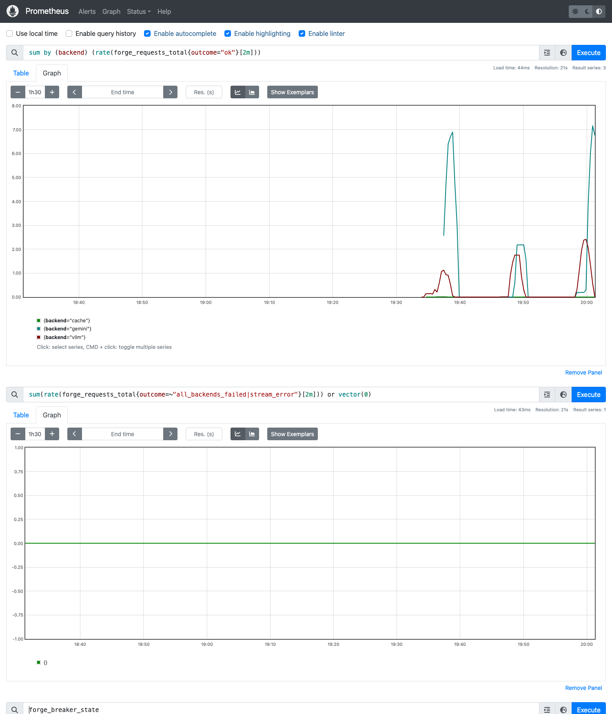
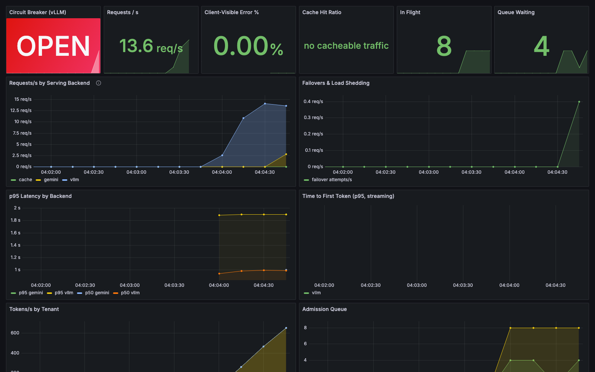
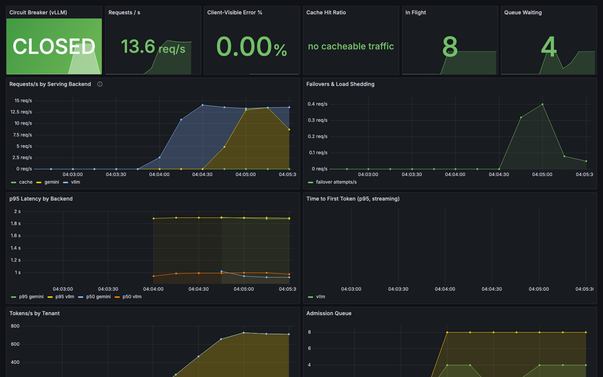

# Forge — a multi-tenant LLM inference platform

[](https://github.com/harshit-ojha0324/forge/actions/workflows/ci.yml)
[](LICENSE)


An inference gateway + agent runtime on Kubernetes: one OpenAI-compatible
endpoint in front of self-hosted **vLLM** (spot GPU, scale-to-zero) with
**circuit-breaker failover to Gemini**, per-tenant API keys and token
quotas, admission control with load shedding, a Redis response cache, and
full observability. Provisioned by **Terraform**, deployed by **ArgoCD** —
a git push is the only deploy mechanism — and gated in CI by an **eval
suite that includes a live failover drill**.

## The demo: kill the primary model server under load



*Timelapse of a real run: 12-way concurrent load at ~14 req/s. The primary
(vLLM) is killed mid-run — the breaker trips to OPEN (red), traffic shifts
to the Gemini backend (yellow area), and the client-visible error rate
stays pinned at 0.00%. When the primary comes back, a single half-open
probe closes the breaker and traffic returns home (blue).*

Numbers from that run (local stack, mock model backends — the same
gateway code that runs on GKE; a real-GPU preemption drill is stage 6):

| Metric | Value |
|---|---|
| Requests completed | **1,649** |
| Served by fallback during the outage | 565 |
| Client-visible failures (5xx) | **0** |
| p50 / p95 latency | 892 ms / 1,166 ms |
| Recovery mechanism | 1 half-open probe (no thundering herd) |

Reproduce it yourself — no cloud, no GPU, no API keys needed:

```bash
make up      # full stack on docker-compose: gateway, mock backends, redis,
             # prometheus, grafana, jaeger
make demo    # 60s load + kill + revive; watch localhost:3000/d/forge-overview
make evals   # the 25-check deploy gate, incl. the failover drill
```

## Architecture



The request path is ordered deliberately: **auth → quota → cache →
admission → breaker-routed backend → metering**. Auth first so anonymous
traffic never touches Redis; quota before cache so an exhausted tenant is
out of tokens even for cached answers; cache before admission so hits
don't consume concurrency slots; admission before the backends because
GPU batch capacity is the scarce resource worth protecting.

### Design decisions worth arguing about

- **Breaker, not retries.** During an outage, retry-first makes every
  request pay the connect timeout before failing over. The breaker makes
  "known dead" a free routing decision, and its half-open state sends
  exactly one probe at recovery instead of a herd.
- **Streams fail over only before the first byte.** Once output reached
  the client, replaying on another backend would duplicate or diverge —
  so mid-stream failures terminate honestly and count against the breaker.
- **Shed early, queue small.** A bounded queue absorbs bursts; beyond it
  the gateway 429s immediately with `Retry-After`. Queueing past capacity
  adds latency, never throughput.
- **4xx never fails over.** A bad request is the caller's fault; only 5xx
  and transport errors count against the breaker — client bugs shouldn't
  look like outages.
- **Only `temperature=0` is cached.** Replaying one sample from a
  sampling distribution silently changes model behaviour.
- **Quota checks at admission, charges after the response** — pre-reserving
  tokens for an unknown-length response rejects legitimate work; the
  bounded overshoot is documented instead.
- **Redis fails open.** Quotas and the cache are conveniences, not
  serving dependencies: if Redis dies, requests still serve (unmetered,
  uncached) and `forge_redis_errors_total` alerts operators — instead of
  a metering store outage becoming a client-facing one.
- **Spot GPU everywhere it's safe.** The breaker is precisely what makes
  a 30-second-notice spot T4 acceptable as the primary backend. Deleting
  the vLLM app scales the GPU pool — and its bill — to zero.

## Running in production on GKE

The platform runs live on a GKE cluster provisioned entirely by
[Terraform](infra/terraform/) — custom VPC, Cloud NAT, **nodes with no
public IPs**, workload identity (no key files anywhere), a spot CPU pool
for services and a spot T4 pool that autoscales 0→1 only when the vLLM
pod schedules.

Deployment is GitOps end-to-end: one `kubectl apply` of the
[ArgoCD root app](deploy/argocd/root-app.yaml), and every service, chart
bump, and config change after that ships by git push (`prune` +
`selfHeal` keep the cluster converged to the repo).

First eval run against the live cluster, before the GPU stage was synced:

```
PASS  prompt/traffic-basic     2.05s via gemini
PASS  prompt/incident-summary  1.44s via gemini
...
24/24 checks passed
DEPLOY GATE: PASS
```

Every check served `via gemini` with `forge_breaker_state 2.0` (OPEN) —
the primary backend *didn't exist on the cluster yet*, and no client ever
saw an error. The failover architecture validated itself on day one.

### The drill, repeated for real — up to a genuine spot preemption

The demo above uses mock backends; these didn't. Same gateway on GKE,
primary = actual vLLM serving Qwen2.5-3B on the spot T4. Two escalating
drills:

**Drill 1 — pod kill.** `kubectl delete pod --grace-period=0 --force`
mid-load, in-flight batched requests and all: 892 requests, 96 via vLLM
before the kill, 796 via Gemini after in-request failover, **0 × 5xx**,
p95 2.4 s.

**Drill 2 — real preemption.** `gcloud compute instances
simulate-maintenance-event` on the spot node — on Spot VMs this triggers
an actual GCP preemption, so this exercises the whole reclaim path: node
dies, pods evicted, autoscaler provisions a *fresh* T4, driver install,
image pull, model download. Load generator ran **inside the cluster**
(pod-to-service networking, no tunnel in the measurement path):

| Metric | Value |
|---|---|
| Requests completed | 1,032 |
| Served by vLLM until the node was reclaimed | 264 |
| Served by Gemini after in-request failover | 768 |
| Client-visible failures (5xx) | **0** |
| p50 / p95 latency | 597 ms / 2.4 s |

The cluster's own Prometheus telling the story — three failover events
(the kill + two preemptions), and the client-visible error rate flat at
zero throughout:



Recovery is hands-off both times: pod reschedules (or a fresh node
provisions), the model reloads, readiness passes, and the breaker's
half-open probe brings traffic home (~5–10 min pod-level, ~10–15 min
node-level; see the [runbook](docs/runbook-gpu-node-loss.md)).

### CI: evals gate the deploy

[The pipeline](.github/workflows/ci.yml) runs unit tests → boots the full
compose stack → runs the 25-check eval suite **including a live failover
drill** → only then builds and pushes images for ArgoCD to roll out. A
gateway regression, a broken chart value, or a failed drill blocks the
artifact from ever existing.

## Observability

Grafana dashboard (auto-provisioned locally; shipped to the cluster's
kube-prometheus-stack via a sidecar-labeled ConfigMap), Prometheus SLO
alert rules (client-visible error rate >1% pages; breaker-open and
queue-saturation warn), and OpenTelemetry traces into Jaeger.

| Breaker OPEN, fallback serving, 0.00% errors | Recovered — the full arc in one chart |
|---|---|
|  |  |

## Hardening history (all of it real)

This platform has been externally code-reviewed and battle-tested; the
fixes are in git history with regression tests, and each one is teaching
material in [`curriculum/`](curriculum/):

- **Breaker HALF_OPEN wedge** (external review): a half-open probe that
  was a *streaming* request answered with 4xx never resolved the probe —
  primary permanently disabled. Fixed on both paths + regression test.
- **Redis fail-open**: v1.0 shipped with Redis as an accidental hard
  dependency; a dead metering store became a client-facing outage. Now
  quotas/cache degrade gracefully with `forge_redis_errors_total`.
- **`VLLM_PORT` service-link collision**: Kubernetes injects
  `VLLM_PORT=tcp://…` for a Service named `vllm`; vLLM parses it as
  config and crashes. `enableServiceLinks: false`.
- **Single-GPU rolling-update deadlock**: the new pod waits for a GPU
  the old pod won't release until the new one is ready. `strategy:
  Recreate` — failover absorbs the gap.
- **Eval load-profile recalibration**: the deploy gate correctly blocked
  when real-GPU latency breached an SLO calibrated on mocks — the
  harness was measuring 20-way queue latency, not serving latency. Evals
  now encode concurrency as part of the SLO.
- **Secrets hygiene**: tenant keys rotated to an out-of-band Secret
  (git carries only the reference); a committed `tfplan` purged.

## Repo map

| Path | What it is |
|---|---|
| [`services/gateway/`](services/gateway/) | The inference gateway (FastAPI) — breaker, admission, quotas, cache, failover. 23 unit tests. |
| [`services/mock-llm/`](services/mock-llm/) | OpenAI-compatible mock model server with failure injection (`POST /control`) |
| [`services/agent-demo/`](services/agent-demo/) | LangGraph smart-city agent running as tenant #1 |
| [`infra/terraform/`](infra/terraform/) | GKE, VPC/NAT, IAM + workload identity, spot node pools, Artifact Registry |
| [`deploy/helm/`](deploy/helm/) | Charts: gateway (+ Grafana dashboard ConfigMap), vllm, redis, mock-llm |
| [`deploy/argocd/`](deploy/argocd/) | App-of-apps — the cluster's table of contents in git |
| [`deploy/local/`](deploy/local/) | docker-compose stack mirroring the cluster |
| [`observability/`](observability/) | Dashboard JSON + Prometheus SLO alert rules |
| [`evals/`](evals/) | The 20-prompt eval set + the deploy-gate script |
| [`loadtest/`](loadtest/) | Python load generator + k6 profile |
| [`docs/`](docs/) | [Architecture](docs/architecture.md) · [GPU-loss runbook](docs/runbook-gpu-node-loss.md) · [Cost breakdown](docs/cost.md) · [GCP setup](docs/gcp-setup.md) |
| [`curriculum/`](curriculum/) | Rebuild-and-defend learning program with teach-back question banks |

## Cost

Designed to be almost free: local stage is $0; the cloud footprint is
spot-everything, a free-tier-credited zonal control plane, and a GPU pool
that only exists while a demo is running (~$0.20/hr when on). Full
breakdown and teardown discipline in [docs/cost.md](docs/cost.md).

## License

[MIT](LICENSE)
